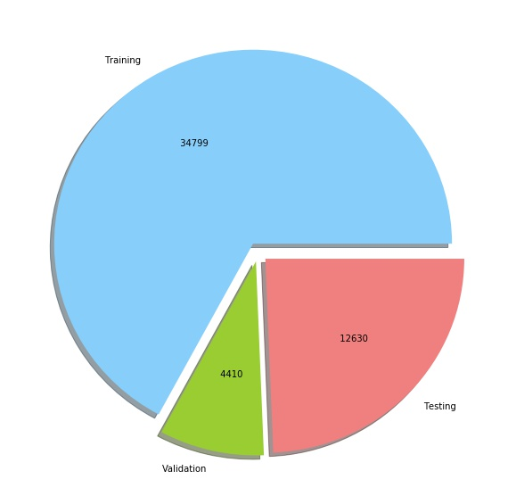
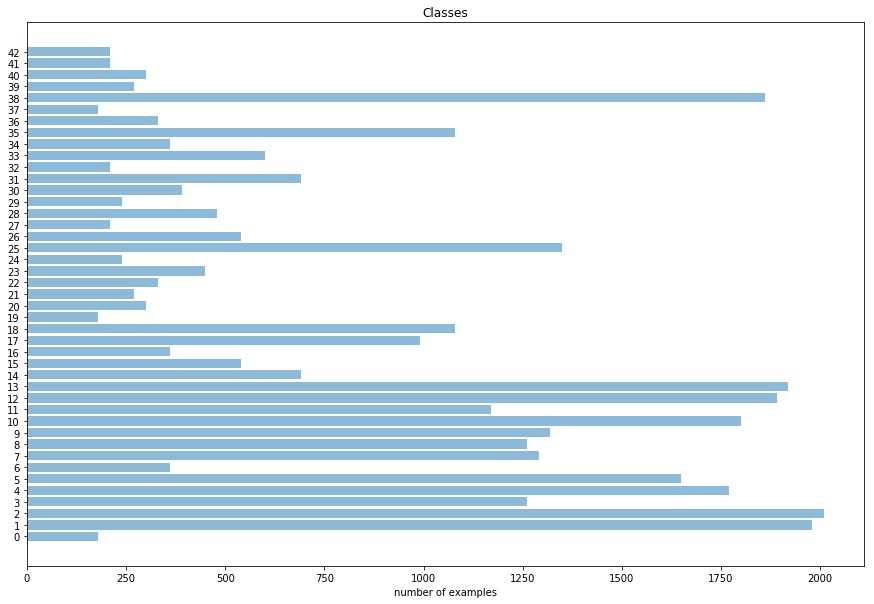
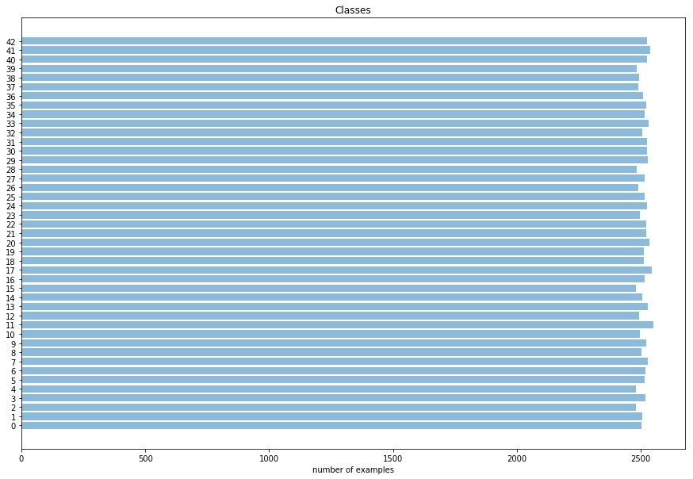
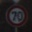
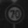
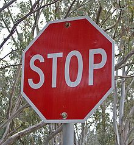

**Traffic Sign Recognition**

---

**Build a Traffic Sign Recognition Project**

The goals of this project are the following:
* Load the data set (see below for links to the project data set)
* Explore, summarize and visualize the data set
* Design, train and test a model architecture
* Use the model to make predictions on new images
* Analyze the softmax probabilities of the new images
* Summarize the results with a written report

## Rubric Points
### Here I will consider the [rubric points](https://review.udacity.com/#!/rubrics/481/view) individually and describe how I addressed each point in my implementation.

---
### Writeup

#### 1. Provide a Writeup / README that includes all the rubric points and how you addressed each one. You can submit your writeup as markdown or pdf. You can use this template as a guide for writing the report. The submission includes the project code.

You're reading it! and here is a link to my [project code](https://github.com/s7s/CarND-Traffic-Sign-Classifier-Project/blob/master/Traffic_Sign_Classifier.ipynb)

### Data Set Summary & Exploration

#### 1.  Summary statistics of the traffic
signs data set:

* Number of training examples = 34799
* Number of validation examples = 4410
* Number of testing examples = 12630
* Image data shape = (32, 32, 3)
* Number of classes = 43

#### 2. Include an exploratory visualization of the dataset.

Here is an exploratory visualization of the data set. It is a pie chart showing how the data divided into sets:

  

Also, Here is an exploratory visualization of the training set. It is a bar chart showing how many example in every class:

  

### Design and Test a Model Architecture

#### 1. Describe how you preprocessed the image data. What techniques were chosen and why did you choose these techniques? Consider including images showing the output of each preprocessing technique. Pre-processing refers to techniques such as converting to grayscale, normalization, etc. (OPTIONAL: As described in the "Stand Out Suggestions" part of the rubric, if you generated additional data for training, describe why you decided to generate additional data, how you generated the data, and provide example images of the additional data. Then describe the characteristics of the augmented training set like number of images in the set, number of images for each class, etc.)

##### 1- data balancing & augmentation
As a first step, I decided to balance the training data by make all the classes has the same number of examples.

And increase the data by augmentation the original data, and the augmentation done by increasing or decrising the pixel values with a random  between \[-5,5\].

then I augment the data again by rotationg them with random degree between\[-20,20\].

the data balancing step to prevent the model to lean toward the class with more examples.

And the augmentation step to make the model away from the overfitting and to increase the dataset.

 here is a bar chart showing how many example in every class after (data balancing & augmentation) step:

   

##### 2- Conversion to grayscale

Then, I converted the dataset to grayscale because there is no need for the colored features.

Here is an example of a traffic sign image before and after grayscaling.

  

  

##### 3- Normalization

I normalized the image data to make its mean =0 and its standard deviation=1 because that make the convergence process.

##### 4- Shuffling data

I shuffled the data to avoid the problems of ordering the data.

#### 2. Describe what your final model architecture looks like including model type, layers, layer sizes, connectivity, etc.) Consider including a diagram and/or table describing the final model.

My final model consisted of the following layers:

| Layer         		|     Description	        					|
|:---------------------:|:---------------------------------------------:|
| Input         		| 32x32x1 grayscale image   							|
| Convolution 5x5     	| 1x1 stride, valid padding, outputs 28x28x6 	|
| RELU					|												|
| Max pooling	      	| 2x2 stride,  outputs 14x14x6 				|
| Convolution 5x5     	| 1x1 stride, valid padding, outputs 10x10x16 	|
| RELU					|												|
| Convolution 3x3     	| 1x1 stride, same padding, outputs 10x10x16 	|
| RELU					|												|
| Convolution 3x3     	| 1x1 stride, same padding, outputs 10x10x16 	|
| RELU					|												|
| Convolution 3x3     	| 1x1 stride, same padding, outputs 10x10x16 	|
| RELU					|												|
| Convolution 3x3     	| 1x1 stride, same padding, outputs 10x10x16 	|
| Max pooling	      	| 2x2 stride,  outputs 5x5x16 				|
| Flatten		| outputs  400   									|
| Fully connected		| outputs 120        									|
| RELU					|												|
| Dropout					|	keep_rate 0.6 											|
| Fully connected		| outputs 84        									|
| RELU					|												|
| Dropout					|	keep_rate 0.6 											|
| Fully connected		| outputs 43        									|
| Softmax				|        									|

#### 3. Describe how you trained your model. The discussion can include the type of optimizer, the batch size, number of epochs and any hyperparameters such as learning rate.

* the optimizer: My model was trained via Adam optimizer. I did not experiment with other optimizers yet, because it gave me good results.

* the batch size: I choose it small as I don't have an Nvidia GPU and I train the model in my labtop.

* the number of epochs: I increased it until I found the accuracies became stable without big diffrence between the validation and training accuracies(no overfitting) and that after I tuned the dropout keep-rate.

* the learning rate: I began with the 0.001 , I noticed that the accuracy increases slowly ,So I tried to increase it bit by bit then I chose the value just before the accuracy began to diverge.
* the dropout keep-rate: firstly I used the keep-rate =1 then I started to decrease it when I found the model overfit.

###### parameters final values:

* the optimizer: Adam optimizer
* the batch size: 128
* the number of epochs: 60
* the learning rate: 0.00122
* the dropout keep-rate: 0.6

#### 4. Describe the approach taken for finding a solution and getting the validation set accuracy to be at least 0.93. Include in the discussion the results on the training, validation and test sets and where in the code these were calculated. Your approach may have been an iterative process, in which case, outline the steps you took to get to the final solution and why you chose those steps. Perhaps your solution involved an already well known implementation or architecture. In this case, discuss why you think the architecture is suitable for the current problem.

My final model results were:
* training set accuracy :  98.9%
* validation set accuracy :  96.8%
* test set accuracy :  94.3%

If an iterative approach was chosen:
* What was the first architecture that was tried and why was it chosen?

I started with a LeNet architecture  because it used before to classify letters and gave good results.

* What were some problems with the initial architecture?

The accuracy was low.

* How was the architecture adjusted and why was it adjusted?

Because of a low accuracy I started to add a convolutional layers.
but that drived the model to overfit ,So I added dropout layers to handle the overfit.

* Which parameters were tuned? How were they adjusted and why?

Number of added convolutional layers: I added one by one until the accuracy stopped increasing.
Dropout keep-rate: firstly I used the keep-rate =1 then I started to decrease it when I found the model overfit.

* What are some of the important design choices and why were they chosen? For example, why might a convolution layer work well with this problem? How might a dropout layer help with creating a successful model?

Convolutional layers worked well because it is image classification problem and we need the convolution to apply the masks on the images.

Dropout helped to handle the overfit problem in the model.

### Test a Model on New Images

#### 1. Choose five German traffic signs found on the web and provide them in the report. For each image, discuss what quality or qualities might be difficult to classify.

Here are five German traffic signs that I found on the web:

||||||

The first image might be difficult to classify because it's not in the center.

The second image might be difficult to classify because of the house in the background.

The third image might be difficult to classify because of its photographing prespective and the trees in background.

The forth and the fifth images might be difficult to classify because of the background also.

#### 2. Discuss the model's predictions on these new traffic signs and compare the results to predicting on the test set. At a minimum, discuss what the predictions were, the accuracy on these new predictions, and compare the accuracy to the accuracy on the test set (OPTIONAL: Discuss the results in more detail as described in the "Stand Out Suggestions" part of the rubric).

Here are the results of the prediction:

| Image			        |     Prediction	        					|
|:---------------------:|:---------------------------------------------:|
| Right-of-way at the next intersection     		| Right-of-way at the next intersection sign   									|
| Priority road | Priority road 										|
| Stop					| Stop											|
| No entry 		| No entry					 				|
| General caution			| General caution      							|

The model was able to correctly guess 5 of the 5 traffic signs, which gives an accuracy of 100%. This compares favorably to the accuracy on the test set of 94.3%

####3. Describe how certain the model is when predicting on each of the five new images by looking at the softmax probabilities for each prediction. Provide the top 5 softmax probabilities for each image along with the sign type of each probability. (OPTIONAL: as described in the "Stand Out Suggestions" part of the rubric, visualizations can also be provided such as bar charts)

For the first image, the model is sure that this is a (Right-of-way at the next intersection) sign (probability of 100%), and the image does contain a (Right-of-way at the next intersection) sign. The top five soft max probabilities were

| Probability         	|     Prediction	        					|
|:---------------------:|:---------------------------------------------:|
| 100.00000%         			| Right-of-way at the next intersection|
| 0.00000%    				|Double curve 				|
| 0.00000%  			|Beware of ice/snow				|
| .0.00000%      			| Pedestrians				 				|
| 0.00000%  		    | Slippery road     							|

For the second image, the model is sure that this is a (Priority road) sign (probability of 99.99920% ), and the image does contain a (Priority road) sign. The top five soft max probabilities were

| Probability         	|     Prediction	        					|
|:---------------------:|:---------------------------------------------:|
|  99.99920%        			| Priority road|
|  0.00080%    				|No vehicles				|
| 0.00000%				|Speed limit (100km/h)		|
| 0.00000%	      			|Speed limit (80km/h)	 				|
| 0.00000%				    | Speed limit (120km/h)						|

For the third image, the model is sure that this is a (Stop) sign (probability of 99.99986% ), and the image does contain a (Stop) sign. The top five soft max probabilities were

| Probability         	|     Prediction	        					|
|:---------------------:|:---------------------------------------------:|
| 99.99986%      			| Stop  									|
| 0.00015%  				| Turn left ahead 										|
| 0.00000%		|Dangerous curve to the left			|
| 0.00000%      			| Keep right			|
| 0.00000%		    | Right-of-way at the next intersection|

For the forth image, the model is sure that this is a (No entry ) sign (probability of 100%), and the image does contain a (No entry ) sign. The top five soft max probabilities were

| Probability         	|     Prediction	        					|
|:---------------------:|:---------------------------------------------:|
| 100.00000%      			| No entry  									|
| 0.00000%	    				|Bumpy road									|
| 0.00000%					| Go straight or left						|
| 0.00000%	      			|Slippery road		 				|
| 0.00000%				    | Turn left ahead  							|

For the fifth image, the model is sure that this is a (General caution ) sign (probability of 100%), and the image does contain a (General caution) sign. The top five soft max probabilities were

| Probability         	|     Prediction
|:---------------------:|:---------------------------------------------:|
| 100.00000%     			|General caution  									|
| 0.00000%				|Traffic signals							|
| 0.00000%			| Pedestrians			|
| 0.00000%     			|Right-of-way at the next intersection	 				|
| 0.00000%	    |End of no passing|
